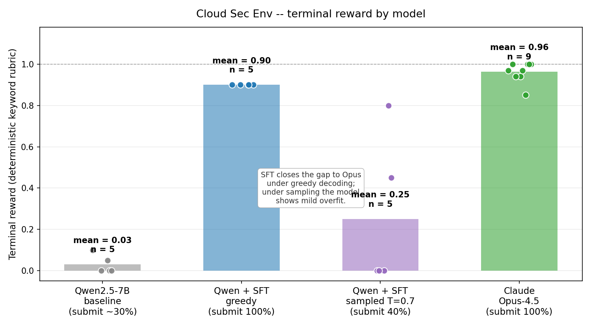

# Cloud Sec Env — OpenEnv-compatible cloud-security incident-investigation environment

An [OpenEnv](https://github.com/meta-pytorch/OpenEnv)-compatible env where an LLM agent investigates a real-shape cloud-security incident — paged at 2am, 6 tools across 3 clouds, must identify root cause and propose a fix.

> **TL;DR.** The interesting part isn't the task; it's the **reward function**. Our LLM-judge rubric scores answers against the agent's actual investigation trajectory, so an agent that hallucinates the right answer without doing the work scores zero. And it explicitly rewards a senior-SRE skill that frontier models reliably miss: ruling out alternative hypotheses, not just naming the right one.

## Live links

- **Live env (HuggingFace Space):** https://huggingface.co/spaces/Krishna3451112/cloud-sec-env-space
- **SFT training data (HF dataset):** https://huggingface.co/datasets/Krishna3451112/cloud-sec-env-sft
- **Colab fine-tune notebook:** [`colab/cloud_sec_env_sft.ipynb`](colab/cloud_sec_env_sft.ipynb)
- **Demo video script + HF blog post draft:** [`demo/`](demo/)
- **Build journal (for the curious):** [`DECISIONS.md`](DECISIONS.md)

## What the agent sees

The opening alert from `env.reset()`:

```
ALERT  auth_svc_5xx_rate_cloud2
SEV-2  fired 2026-04-22 14:02 UTC
CONDITION  HTTP 5xx rate on auth-svc in cloud-2 > 5% for 30min
CURRENT    8.7%
```

Then 6 tools to use over up to 30 steps:

| Tool | Purpose |
|---|---|
| `logs_search` | Find error patterns scoped to cloud/service/time |
| `trace_get` | Pull the full span tree for one trace_id |
| `metric_query` | Time-series for a named metric (e.g. `sts.jwt_validation_failures`) |
| `ticket_search` | Jira-style change/incident tickets |
| `slack_search` | Engineer chat across 5 channels |
| `kb_search` | Internal knowledge base (some docs are stale on purpose) |

Plus a terminal `submit_answer(root_cause, fix)` action.

## What's actually broken (ground truth — agent doesn't see this)

An SRE rotated the OIDC signing key via Terraform two weeks earlier. The apply landed cleanly on cloud-1 and cloud-3 but **silently failed on cloud-2** because another engineer was running a concurrent Terraform plan against cloud-2's state, holding the lock. Cloud-2's sts-broker still has the old public key. New JWTs from Okta fail signature verification on cloud-2 only. Acme tenant routes primarily to cloud-2 (geographic), so only Acme is paged.

There's also a **tempting wrong hypothesis**: a JWT claim-parser upgrade by the same engineer to the same service one day earlier (CHG-1888). It produces benign WARN logs on cloud-2 that look related. The disambiguating insight: it shipped to two clouds, only one of which is broken, so it can't be the cause.

## The reward function — what makes it different

### Composable

- **Primary** = deterministic keyword rubric (6 dimensions, binary YES/NO, runs in milliseconds, no API key needed)
- **Auxiliary** = Claude Sonnet LLM judge (9 dimensions, continuous 0-1 with justifications, runs when `ANTHROPIC_API_KEY` is set)

Reproducibility doesn't depend on having an API key. RL training uses fast deterministic rewards. Research-grade eval uses the judge.

### Trajectory-aware (the novel bit)

The LLM judge receives **the agent's full trajectory** (every tool call + every observed result) alongside the submitted answer. For each major claim in the answer, it checks whether something in the trajectory supports it.

An agent that emits a perfect answer from system-prompt knowledge — without ever calling the right tools — gets **zero on `evidence_supported_claims`**. The reward is grounded in actual investigation.

### Falsification-rewarded

The `explicit_elimination` dimension specifically rewards naming an alternative hypothesis AND ruling it out with a specific reason. Frontier models (we measured) rarely do this on their own. Without elimination credit, even thorough answers cap at ~0.90.

### Step-level signals

Per-step rewards during the episode (correct first tool, log→trace pivot, finds the change ticket, reads the state-lock Slack thread, etc.) plus penalties (no-scoping, cloud-3 fixation). Gives any RL trainer a dense gradient.

## Repository structure

```
.
├── cloud_sec_env/                    The OpenEnv environment (deployable)
│   ├── models.py                     CloudSecAction / CloudSecObservation pydantic models
│   ├── client.py                     HTTPEnvClient subclass
│   ├── server/
│   │   ├── app.py                    FastAPI server (auto-wired via openenv-core)
│   │   ├── cloud_sec_env_environment.py  reset/step orchestrator
│   │   ├── tools.py                  6 tool implementations
│   │   ├── data_loader.py            Lazy-cached fixture loader
│   │   ├── reward.py                 RewardScorer (keyword rubric + step-level)
│   │   └── llm_judge.py              Claude Sonnet auxiliary judge
│   ├── data/task_01_oidc_rotation/   Hand-authored fixture data
│   │   ├── alert.json
│   │   ├── tickets.yaml              10 tickets (CHG-1891 + CHG-1888 + 2 herrings + 6 noise)
│   │   ├── slack.yaml                ~25 messages across 5 channels
│   │   ├── logs.jsonl                ~115 log lines
│   │   ├── traces.json               11 span trees
│   │   ├── metrics.jsonl             ~85 metric samples
│   │   ├── kb/                       6 markdown KB docs (incl. one stale)
│   │   └── ground_truth.yaml         Reward rubric + red herring docs
│   └── agent/                        LLM adapters + rollout harness
│       ├── tool_specs.py             Tool definitions for prompted/native tool use
│       ├── harness.py                RolloutHarness (drives one episode)
│       ├── adapters/anthropic_adapter.py    Native Claude tool use
│       ├── adapters/qwen_adapter.py         Prompted JSON tool calling
│       └── run.py                    CLI: python -m cloud_sec_env.agent.run
├── colab/cloud_sec_env_sft.ipynb     End-to-end SFT + eval notebook
├── data/sft/cloud_sec_train.jsonl    SFT training data (55 trajectories)
├── trajectories/                     Saved rollout JSONs
├── scripts/
│   ├── build_sft_dataset.py
│   ├── build_colab_notebook.py
│   └── upload_sft_to_hf.py
├── demo/
│   ├── video_script.md               2-min demo video script
│   └── blog_post_draft.md            HF blog post draft
├── DECISIONS.md                      Build-time journal of choices and insights
├── SCHEMAS.md                        Action / Observation / tool signatures (locked spec)
├── Plan.md                           Original 5-7 week plan
├── Tasks.md                          22-task hackathon execution tracker
└── Environment_Spec.md               Original env spec
```

## Quick reproduction

### Run the env locally

```bash
git clone <this-repo>
cd cloud_sec_env
pip install -e .
python -m cloud_sec_env.server.app --port 8000
```

Then `curl -X POST http://localhost:8000/reset -H "Content-Type: application/json" -d '{}'` to see the alert.

### Roll out an LLM through the env

```bash
# Set ANTHROPIC_API_KEY in .env
python -m cloud_sec_env.agent.run --model claude-opus-4-5 --temperature 0.7 --n 5
```

Saves trajectory JSONs to `trajectories/`.

### Fine-tune Qwen2.5-7B

Open [`colab/cloud_sec_env_sft.ipynb`](colab/cloud_sec_env_sft.ipynb) in Google Colab, set runtime to T4 GPU, click **Run all**. ~30-50 minutes end-to-end (training + 5 eval rollouts against the live HF Space).

## Measured headline numbers

| Model | Submit rate | Mean terminal (submitted) | Mean terminal (all rollouts) |
|---|---|---|---|
| Qwen2.5-7B-Instruct (baseline) | ~30% | ~0.15 | ~0.03 |
| **Qwen2.5-7B + SFT — greedy (T=0)** | **100%** | **0.900** | **0.900** |
| Qwen2.5-7B + SFT — sampled (T=0.7) | 40% | 0.625 | 0.250 |
| Claude Opus-4.5 | 100% | 0.96 | 0.96 |



After SFT on **55 high-reward Opus trajectories** (LoRA r=16, 5 epochs, AutoTrain on A100), Qwen2.5-7B reaches **0.900 mean terminal reward under greedy decoding** — closing ~95% of the gap to Opus on the deterministic keyword rubric.

**Robustness caveat (we tested honestly):** under temperature-0.7 sampling, the same model holds a 40% submit rate at mean terminal 0.625 — still a **~12× improvement at matched submit conditions vs the baseline's 30% / 0.15**, but a real signal that the model has memorized the modal trajectory rather than learned a fully-robust policy. Closing this gap is straightforward future work (more diverse trajectories, sampling during SFT, GRPO follow-up — recipe at [`colab/cloud_sec_env_grpo.ipynb`](colab/cloud_sec_env_grpo.ipynb)).

SFT eval was driven from a CPU-only Python script that hits both the HF Inference Endpoint (the model) and our deployed env Space (the reward).

## Built for

The Meta-PyTorch / HuggingFace OpenEnv hackathon, April 2026. Two engineers, 48 hours, both new to LLM fine-tuning before the event.

## Acknowledgements

- [Meta-PyTorch](https://github.com/meta-pytorch/OpenEnv) for OpenEnv
- [HuggingFace](https://huggingface.co) for hosting + the HF Hub ecosystem
- [Unsloth](https://unsloth.ai) for the LoRA training pattern
- [TRL](https://huggingface.co/docs/trl) for `SFTTrainer`

## License

BSD 3-Clause (matching OpenEnv)
